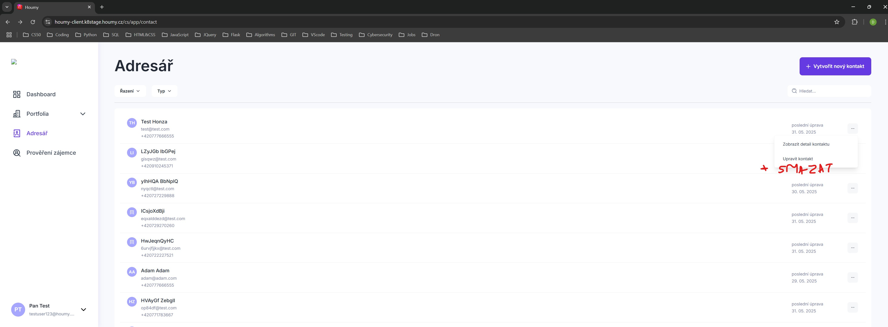

# HMBR01: User is unable to delete contacts

## Description
The user is unable to delete existing contacts in the address book. The delete option is missing from the contact options menu.

## Environment
- OS: Windows 11 Home - 24H2
- Browser: Google Chrome - Version 136.0.7103.116

## Application Environment
- Environment: k8stage
- Version: 1.265

## Priority
Low – Does not affect core functionality.

## Preconditions
1. The user is registered in the application.
2. The user has at least one saved contact in the address book.

## Steps to Reproduce
1. Go to [www.houmy.cz](https://www.houmy.cz) and log in to the application.
2. On the main page, open the address book by clicking the **Adresář** button.
3. Click the **...** button next to any existing contact to open the options menu.

## Actual Result
The options menu only allows the user to view contact details or update the contact information. The delete option is missing.

## Expected Result
The options menu should include an option to delete the selected contact.

## Attachments
