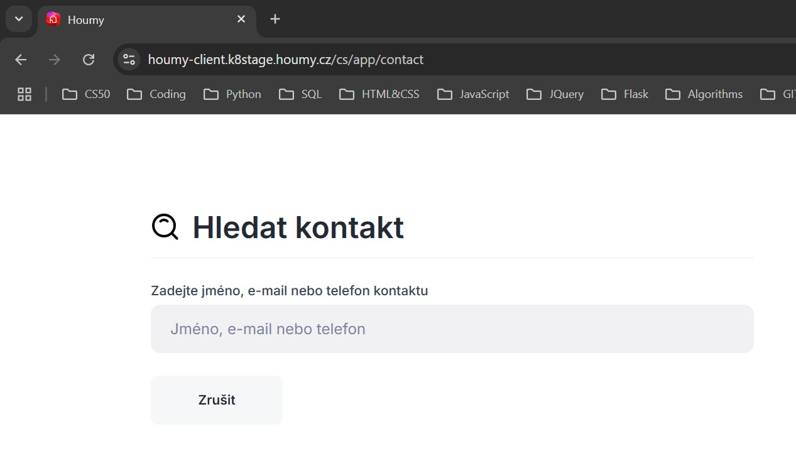
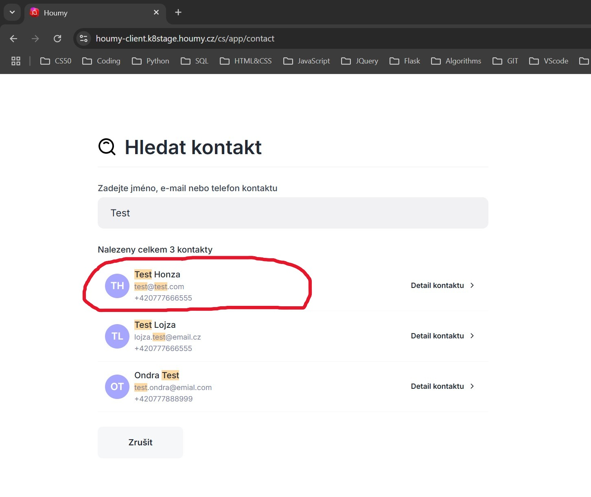
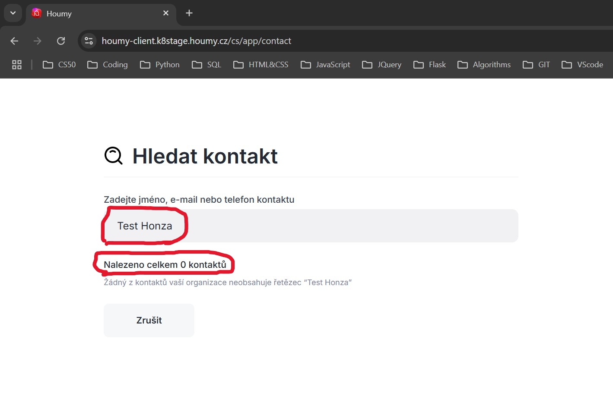
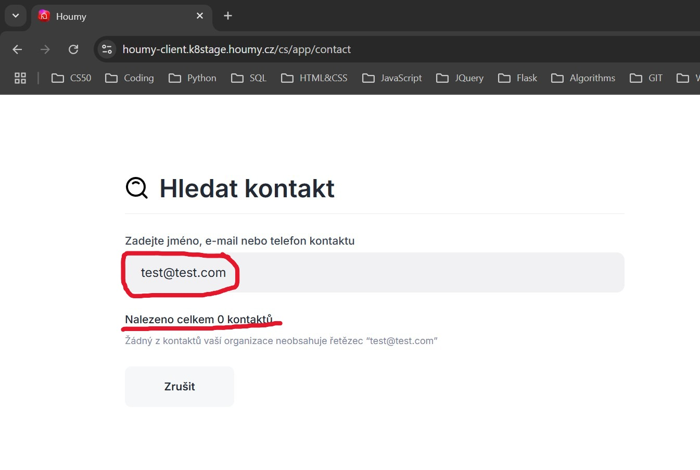
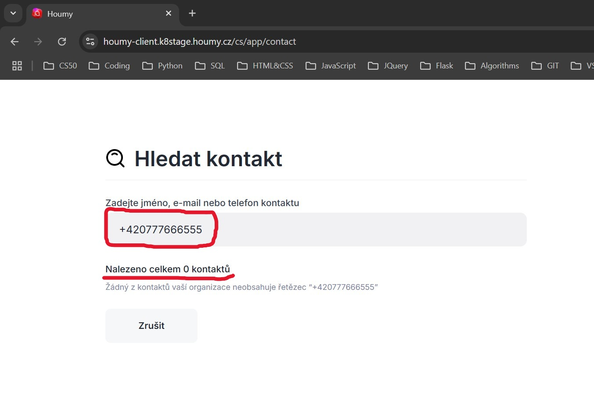

# HMBR02: Search in Contacts Form Works Only for First Name

## Description
The user is unable to search contacts by entering the full name, email address, or phone number in the contact search form. The search currently works only for the first name.

## Environment
- OS: Windows 11 Home - 24H2
- Browser: Google Chrome - Version 136.0.7103.116

## Application Environment
- Environment: k8stage
- Version: 1.265

## Priority
Low – Does not affect core functionality.

## Preconditions
1. The user is registered in the application.
2. The user has at least one saved contact in the address book with valid first name, last name, email, and phone number.

## Steps to Reproduce
1. Go to [www.houmy.cz](https://www.houmy.cz) and log in to the application.
2. On the main page, open the address book by clicking the **Adresář** button.
3. Click the **Vyhledat** button in the top right corner to open the search contacts form.
4. Try to search for an existing contact by:
    - Full name
    - Email address
    - Phone number

## Actual Result
The application displays a message that no contacts exist.

## Expected Result
The application returns the contact(s) that match the entered full name, email address, or phone number.

## Attachments
- 
- 
- 
- 
- 