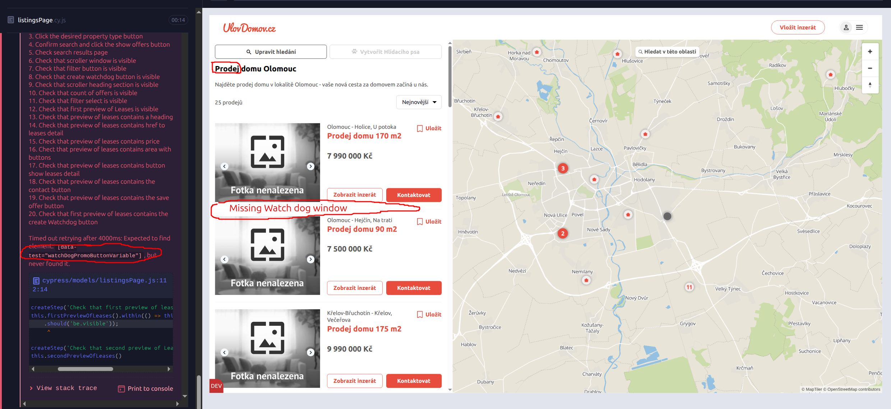

# UDBR01: Watchdog panel missing in sales listing results

## Description
When searching for properties with the **sale** offer type, the **"Create Watchdog"** panel does not appear in the listings sidebar. This may lead to users missing a key feature of the platform.

## Environment
- OS: Linux Mint 22.1 Cinnamon – Kernel 6.4.8
- Browser: Google Chrome – Version 136.0.7103.116

## Application Environment
- Environment: k8stage
- Version: 1.265

## Priority
Low – The user is not informed about a key feature (watchdog creation) when it should be available.

## Preconditions
1. A valid search has been performed from the main page with **sale** offer type selected (including valid address, property type, and offer type).

## Steps to Reproduce
1. Go to [www.ulovdomov.cz](https://www.ulovdomov.cz) and log in to the application.
2. Use the search bar to enter valid parameters with **sale offer type** selected (e.g., city, offer type, property type), and perform a search.
3. Observe the listings sidebar on the search results page.

## Actual Result
The **"Create Watchdog"** panel is missing in the listings sidebar of the search results page.

## Expected Result
The user should see and be able to interact with the **"Create Watchdog"** panel in the sidebar of the search results page.

## Attachments

